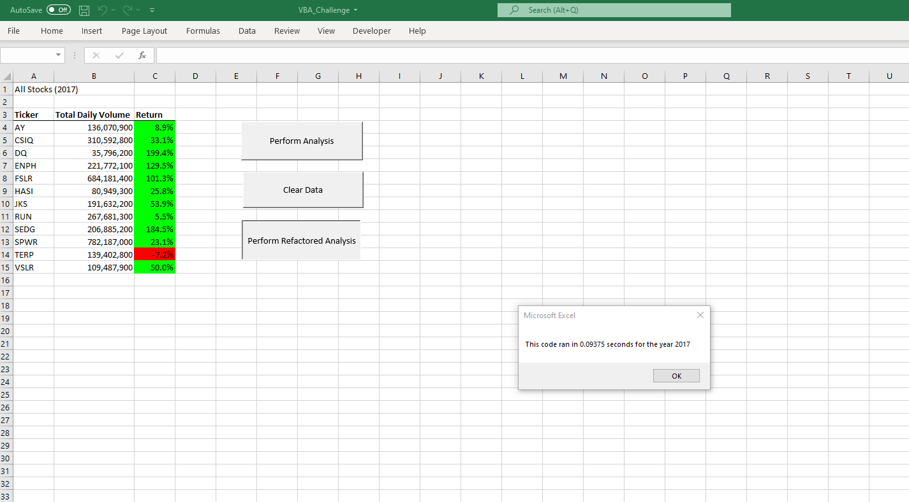
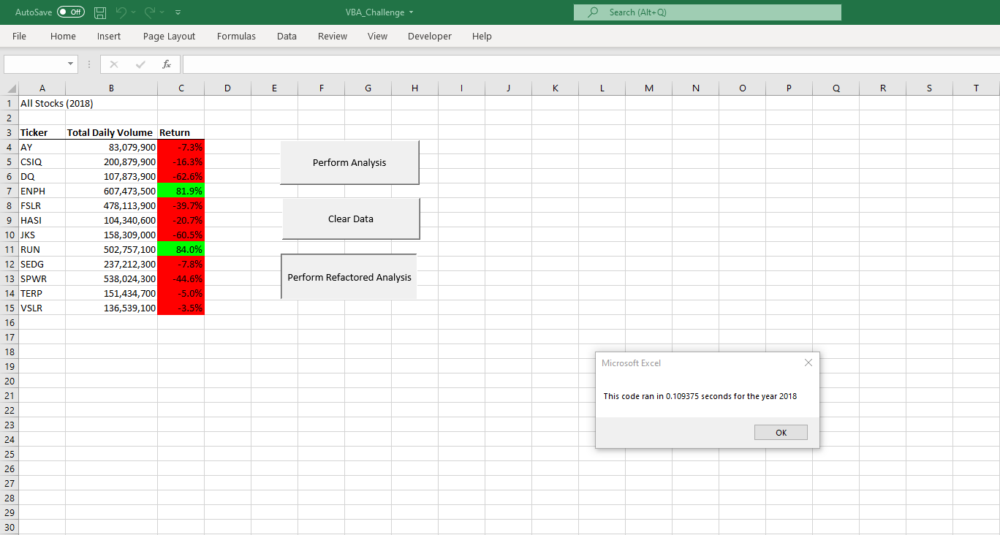

# An Analysis of 2017 & 2018 Clean Energy Stocks

## Overview of Project and Purpose

This project involves a large data set of stocks and their statistics. The purpose of this project has two aspects. First, to provide a thorough analysis of the stocks performance, which will help the client decide on a proper investment strategy. It is also important that the analysis is presented in a clear and visually appealing way. Doing this will allow the cient to be able to easily identify which stocks performed well and which did not. The second aspect of this project is to complete this task using readable and efficient VBA code. Although there are multiple ways or strategies to write the code which will complete the task, it is important to do it in an efficient manner. This will be completed by refactoring code so that it runs quicker on a much larger data set. This will be verified by implementing the Timer function. 
 
## Results and Analysis

As pictured, the refactored code ran in approximately .09 seconds. Prior to refactoring the code, the run time was approximately .74 seconds. The code was refactored from iterating through the entire data set (approx. 3,000 rows) 12 times (for each stock 'Ticker') to iterating through the data set 1 time. This was completed by going from a nested For loop to a single For loop (while outputting the results using Arrays). It can be expected the time differance of runtimes will only increase as the data sets gets larger. As per the analysis output, 2017 appears to have been a good year for almost all of the analyzed stocks. The only stock which had a negative return was TERP. The highest performing stock was DQ with a return of 199.4%.  

As pictured, the refactored code ran in approximately .10 seconds as compared to the original code which had a runtime of approximately .80 seconds. The code and data set was the same as explained above. In reference to the stocks, it is apparent that 2018 was tough year as the Return values are much lower. Only the ENPH and RUN stocks provided a positive return, which also makes them the only stocks which provided a positive return in both years. ENPH's return decreased from 2017 to 2018 while RUN's return increased. The total daily volume of ENPH and RUN both increased significantly from 2017 to 2018. 

## Summary

### Advantages of Refactoring Code

The are a few advantages of refactoring code. The first would be the run time of the program. Refactored code should run faster and more efficient. This could prove very valuable when applying it to larger programs. Refactoring code also makes a program more readable and easier to understand. In general, the least complex the code, the better. Quite often code needs to be altered for a variety of reasons and when this is completed it is easier to make changes when the code is clear, concise, and easily understood. There should not be repeated lines of code which accomplish the same task which a single or fewer lines of code can accomplish. Another advantage of refactoring code would be the elimination of 'magic numbers' as they cloud what the intent of the code is. This also lends to a more readable code. 
When comparing the refactored code of this VBA script it is clear that the original code appears much more complex due to the nested For loops. The refactored code appears much more concise and clear. It is easier to read and understand. If this code needed to be changed in the future, it would now be easier to do so. 

### Disadvantage of Refactoring Code

Refactoring existing code does come at a cost. One disadvange is that refactoring will require additional time to complete the project. With this additional time, the user may get the same result. One could argue that tenths of a second of runtime may not be worth the additional work time required. However, the more efficient the code, the better and quicker it will run as the data sets grow. Another disadvantage is the possibility of the code not producing the same result. 

 
