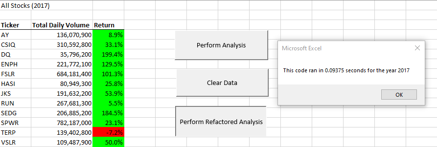
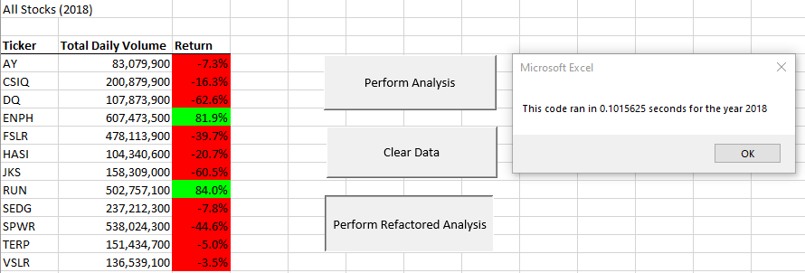

# An Analysis of 2017 & 2018 Clean Energy Stocks

## Overview of Project and Purpose

This project involves a large data set of stocks and their statistics. The purpose of this project has two aspects. First, to provide a thorough analysis of the stocks performance, which will help the client decide on a proper investment strategy. It is also important that the analysis is presented in a clear and visually appealing way. Doing this will allow the cient to be able to easily identify which stocks performed well and which did not. The second aspect of this project is to complete this task using readable and efficient VBA code. Although there are multiple ways or strategies to write the code which will complete the task, it is important to do it in an efficient manner. This will be completed by refactoring code so that it runs quicker on a much larger data set. This will be verified by implementing the Timer function. 
 
## Results and Analysis

prior to refactoring the code, the run time was approximately .74 seconds

prior to refactoring the code, the run time was approximately .80 seconds. 

### Advantages of Refactoring Code

### Disadvantage of Refactoring Code

Refactoring existing code does come at a cost. One disadvange is that refactoring will require additional time to complete the project. With this additional time, the user may get the same result. One could argue that tenths of a second of runtime may not be worth the additional work time required. However, the more efficient the code, the better and quicker it will run as the data sets grow. 

## Summary
